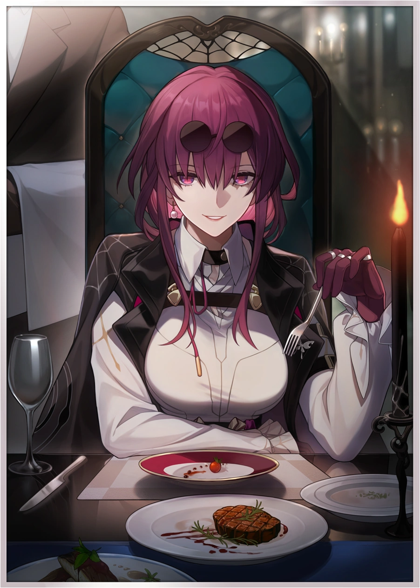
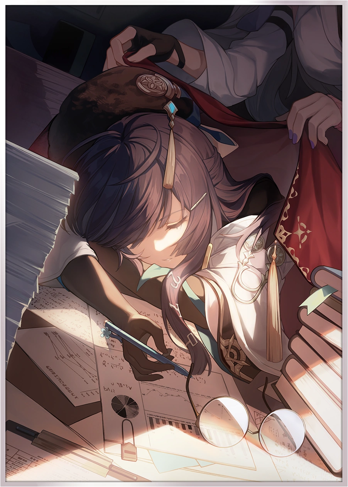
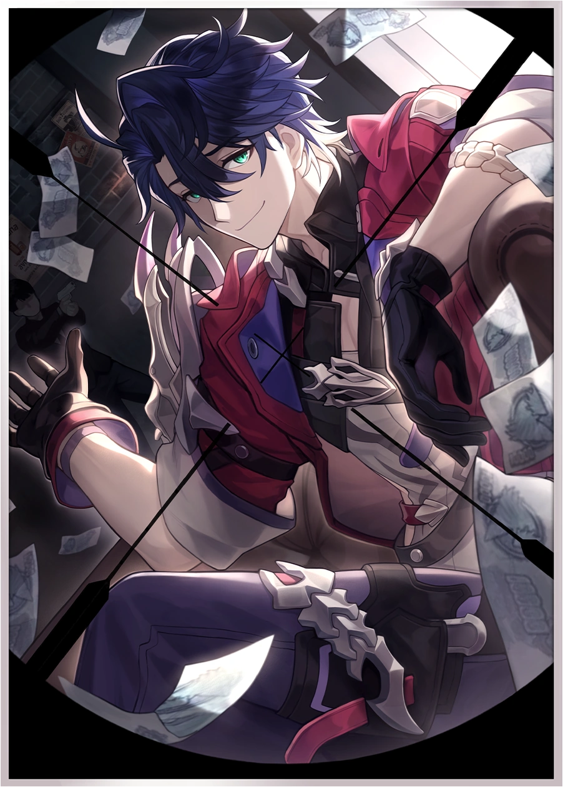
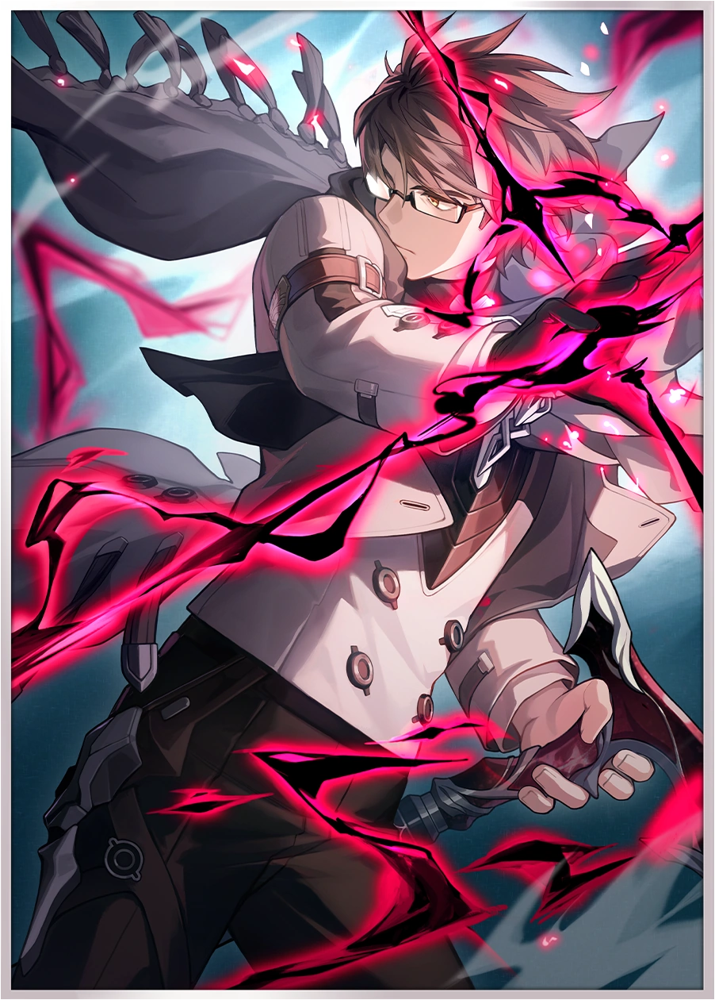
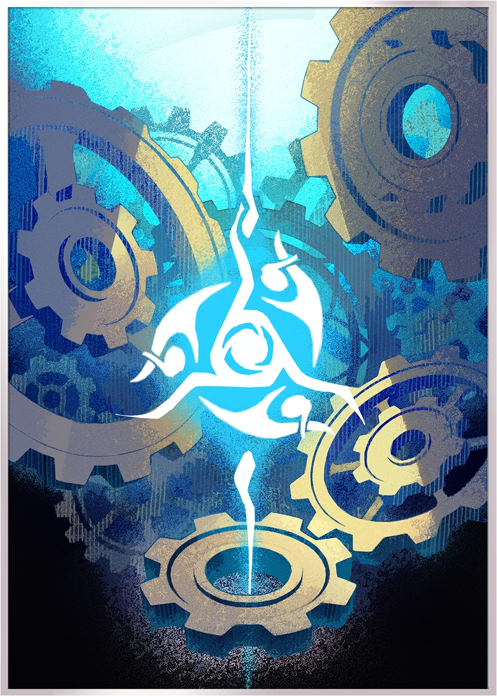

---
title: "Kafka, Stellaron Hunter "
date: '2024-01-12'
showauthor: false
authors:
  - 'agentyoda'
showAuthorsBadges : false 
---

## Introduction

We all began our journey in Honkai: Star Rail watching a mysterious woman play the violin, losing herself to the gentle, hopeful, joyous tones of Pachelbel’s Canon in D, untroubled by the worries around her: alarms rang, monsters attacked, people evacuated—and then when it came her time, she sprung into action. That was our introduction to the game, the first hook that got us interested: who was this woman, and what did she mean by “Elio,” “the script,” “Destiny’s Slave,” and her parting, almost loving speech to the protagonist, whom she awakened from some kind of stasis or slumber?

Such was our introduction to Kafka, the very first character we meet, and one who is foreshadowed to play a part through the whole Star Rail saga—along with an important place in the heart of our own character. For the many players who were fascinated by her from the moment the game began, and for those who came to enjoy her through the story, or simply for those who like damage over time gameplay, this guide is for you.

Herein, we describe the character in detail: her traits, eidolons, and playstyle, before delving into the particulars of how to build her and different teams to build around her. Kafka is the centerpiece of damage over time builds as they currently stand, being able to trigger additional “ticks” of damage with her abilities. True to her character, she creates a unique team wherever she is present.

## Optimal vs. Strong vs. Viable

The focus of this guide is on the experience of the player: we want to aid Kafka players in having the best experiences with this character in the game as possible. As such, one important facet about the philosophy behind this guide is the difference between the “optimal” team for a fight, a “strong” team for a fight, and a “viable” team for a fight. To demonstrate this, let’s consider the following scenarios: suppose you have three teams: a Quantum team, an Imaginary team, and a Fire team. Suppose we measure how quickly they clear two fights: Fight #1 against quantum-weak enemies and Fight #2 against imaginary weak enemies. We can imagine that the results may be that, for Fight #1, they cleared in this order: Quantum team, Imaginary team, Fire team. For Fight #2, they cleared in this order: Imaginary team, Quantum team, Fire team. Which team is the “optimal” team?

The correct answer would be that it depends on the enemies: Quantum for Fight #1 and Imaginary for Fight #2. But it’s possible that, say, the difference between Quantum and Imaginary teams is only roughly 10% in damage output/clear speed. We would call both of these teams “strong” teams, because their performance is very similar and close to the optimal clear speed for the fight. In that case, a player’s experience piloting those two teams will be very similar—recommending one over the other solely based on that experience wouldn’t make sense, so we would recommend both.

However, if the Fire team is lagging behind by 50%, we might not want to call the Fire team “strong”; we might instead merely call them “viable”, because they were able to clear the fight! They may even do so without any deaths and still gaining stars in Memory of Chaos. But there is a significant difference in the experience of the fight and the clear speed of the fight compared to the “strong” teams, so we wouldn’t recommend them in the same manner as we would the “strong” teams.

The division between “strong” and “viable” can be somewhat arbitrary in some cases; a full analysis would require analyzing many teams across many fights and attempting to group stronger teams together to create a clean delineation between these categories. Perhaps that will be a useful exercise for theory-crafters in the future. But based on our present knowledge and calculations across a number of simulations, we can see how certain teams are close together in damage for various scenarios, whereas some others are outliers, lacking enough in damage that they are not in the same category: the experience playing them differs significantly, particularly in higher end content.

As such, we will be using these terms through the guide: “strong” will be used for teams that may be optimal in some scenarios but are at least close to optimal for many scenarios (exceptions will be noted in the team description), so a player’s experience piloting those teams will be consistently “strong”; on the other hand, “viable” will be used for teams that work and can clear content, but whose experience and clear speed significantly lags behind the “strong” teams. We won’t discuss “optimal” teams very much, simply because, as the above discussion hopefully illustrates, a singular “optimal team for all content” is not how we approach the game. If our focus is on the experience of the player first and foremost, then recommending any strong team for the player will allow the player to choose between what they want and are able to attain, while maintaining the experience of piloting a strong, competitive Kafka team.

## Why Choose Kafka?

### Pros:

- She likes classical music

- Her voice is cool

- She is the centerpiece of the Damage over Time playstyle so far & can be combined with nearly any Damage over Time unit to form a viable team

- Her Follow-up Attack applying her Shock is surprisingly nice for auto-play and provides great consistency in damage, even without her Ultimate

- Gearing is much more pleasant and forgiving. Her damage scales heavily from Ultimate and Skill levels, and so she’s less reliant on particular gear pieces—in particular, she doesn’t need any crit pieces at all and will function great with some good main piece sets and some Speed/ATK% substats.

- Her banner contains several of her best teammates (Sampo and Luka) to make for easier team building and bonus 4 star eidolons

- Her Light Cone banner contains several of the best Light Cones for her best teammates (Luka’s Light Cone and Sampo’s Light Cone) to make for easier team building, if rolling for her signature Light Cone

### Cons:

- Her teams want Damage over Time characters, who aren’t as usable in other teams and can take many Trace materials/credits/XP mats to build (i.e. Sampo, Luka, Serval)

- Limited banner

- Heavy scaling of damage from Ultimate, Skill, and Trace levels, so Trace materials are very important to farm

## Skills and Traces
### Skills

- Basic Attack - Midnight Tumult

- Deals Lightning DMG equal to (50-100)% of Kafka's ATK to a single enemy.

- Skill - Caressing Moonlight

- Ultimate - Twilight Trill

- Deals Lightning DMG equal to (48-80)% of Kafka's ATK to all enemies, with a 100% base chance for enemies hit to become Shocked and immediately take DMG from their current Shock state, equal to (80-100)% of its original DMG. Shock lasts for 2 turn(s).

- While Shocked, enemies receive Lightning DoT equal to (116-290)% of Kafka's ATK at the beginning of each turn.

- Talent - Gentle but Cruel

- After an ally of Kafka's uses Basic ATK on an enemy target, Kafka immediately launches 1 follow-up attack and deals Lightning DMG equal to (42-140)% of her ATK to that target, with a 100% base chance to inflict Shock equivalent to that applied by her Ultimate to the attacked enemy target for 2 turns. This effect can only be triggered 1 time per turn.

- Technique - Mercy Is Not Forgiveness

- Immediately attacks all enemies within a set range. After entering battle, deals Lightning DMG equal to 50% of Kafka's ATK to all enemies, with a 100% base chance to inflict Shock equivalent to that applied by her Ultimate on every enemy target for 2 turn(s).

### Major Traces:

- Thorns

- The base chance for Ultimate, Technique, or the follow-up attack triggered by the Talent to inflict Shock increases by 30%.

- Plunder

- If an enemy is defeated while Shocked, Kafka additionally regenerates 5 Energy.

- Torture

- When the Ultimate is used, enemy targets will now receive DMG immediately from all currently applied DoT sources instead of just receiving DMG immediately from the currently applied Shock state.

### Minor Traces:
- 18% Effect Hit Rate

- 28% ATK

- 10% Max HP

## Kafka Playstyle

Kafka teams are dependent on Kafka’s procs of Damage over Time applied to enemies with her Skill and her Ultimate; thus, the best Kafka team rotations are going to be those that consistently apply Damage over Time effects and DEF/RES debuffs to enemies before trying to use as many Skill and Ultimate casts as Kafka can get. More on specific team rotations will be covered in the Team Compositions section, but it’s important to note that, outside of team specific rotational requirements (such as needing to use a Skill for a unit to get their energy filled back in time to use their Ultimate again), the goal should be to ensure Kafka uses her Skill as often as possible on Damage over Time-afflicted enemies. Ideal Kafka gameplay will have few, if any, Kafka Basic Attacks (not including her Follow-up Attack here; that should be proc’d every turn, if possible, by having an ally use a Basic Attack, as the Follow-up Attack deals damage, gains Kafka energy, and applies/re-applies her Shock to the target enemy). The rest of Kafka’s team’s playstyle revolves around how that team functions, some of which are covered in more detail later.

### Opener

If Kafka doesn’t have her Ultimate available and will be facing multiple enemies (as is usually the case), then it’s best to begin with Kafka’s Technique so as to apply Shock to all enemy units, so that she can use her Skill on her first turn and proc her Shock again. Otherwise, against a single target, an ally can use a Basic Attack to trigger Kafka’s Follow-up to apply her Shock (if said ally is faster than Kafka).

The remainder of the rotation depends on which team Kafka is in, though in general, Kafka could attempt to always use her Skill until she can cast her Ultimate.

## Eidolons

Kafka’s Eidolons, in general, give fairly significant damage increases but are unnecessary for Kafka’s core gameplay loop. The eidolons are listed below with some sample percent damage increases, though these are not absolute; they indicate the approximate damage increase one might expect for some of the fully built Kafka teams noted in the “Team Compositions” section, so the damage gained by some eidolons may differ from these projections based on how one’s Kafka team is built.

===

E1: Da Capo - ~17% more team damage against a single target
When the Talent triggers a follow-up attack, there is a 100% base chance to increase the DoT received by the target by 30% for 2 turn(s).

===

E2: Fortississimo - ~11% more team damage
While Kafka is on the field, DoT dealt by all allies increases by 25%.

===

E3: Capriccio
Skill Lv. +2, up to a maximum of Lv. 15.
Basic ATK Lv. +1, up to a maximum of Lv. 10.

===

E4: Recitativo - with ERR rope and Kafka’s signature Light Cone, this allows for a 2 turn Ultimate rotation (if using her Skill twice in a row)
When an enemy target takes DMG from the Shock status inflicted by Kafka, Kafka additionally regenerates 2 Energy.

===

E5: Doloroso - E3 and E5 combined give about 6% more team damage
Ultimate Lv. +2, up to a maximum of Lv. 15.
Talent Lv. +2, up to a maximum of Lv. 15.

===

E6: Leggiero - ~16% more team damage
The Shock inflicted on the enemy target by the Ultimate, the Technique, or the Talent-triggered follow-up attack has a DMG multiplier increase of 156% and lasts 1 turn(s) longer.

===

If we rank the Eidolons for their approximate contribution for team damage: E1 > E2 > E6 > E5/E3, with E4 giving us potential for a 2 turn Ultimate rotation cycle even against a single target—this grows further in value against multiple targets and Lightning-weak enemies.

## Light Cones

Kafka’s initial Light Cone banner has a very strong line-up: her signature Light Cone, Patience is All You Need, Luka’s 4 star Light Cone, Resolution Shines as Pearls of Sweat, Sampo’s 4 star Light Cone, Eyes of Prey, and an admittedly less useful option for us, The Birth of the Self (which is not Nihility, so it isn’t useful for Kafka or her Nihility teammates). While we’ll discuss her team compositions in the section to follow, we will list Luka and Sampo’s light cone preferences here, given that we can roll for not just Kafka’s Light Cones, but also Luka’s and Sampo’s Light Cones at the same time with this banner. With the information provided, the choice to roll on her Light Cone banner or not should be more clear by the end of this section.

### 1. Patience Is All You Need


  


This is Kafka’s best Light Cone in general, thanks to the significant Speed buff it gives her (14.4 SPD on Kafka for S1, full stacks). In addition, if the player does not have access to a Superimposition 5 Resolution Shines as Pearls in Sweat or a Superimposition 5 Eyes of Prey and they plan to run Luka/Sampo respectively, then this Light Cone banner is very valuable; you improve the Light Cone options for multiple essential damage characters for the team. However, if the player already has Good Night, Sleep Well with a high Superimposition, as well as appropriately strong Light Cones for Luka/Sampo (if they plan to use them), then the additional value of Patience is All You Need may not be worth the cost to roll for it: it does not provide significant gains over S5 Good Night, Sleep Well—some simulations have it at only around 2-5% more damage.

### 2. Good Night, Sleep Well


  


This Light Cone, at high Superimposition levels (ideally a full 5), provides a very strong alternative to Patience is All You Need, with the damage gain being dependent on how many DMG% increase modifiers one has on the target character. For Kafka, due to the relative scarcity of DMG% increase modifiers compared to the many ATK% increase modifiers she has, Good Night, Sleep Well performs very well, only a few percent less damage on average than Kafka’s signature Light Cone.
This Light Cone can also be the best Light Cone for other characters as well under most conditions—Sampo and Luka, for example, perform very well with Good Night, Sleep Well, even compared to their signature 4 star Light Cone.
It should be noted that this is strictly for high Superimposition values; for lower values, such as S1, Good Night, Sleep Well doesn’t perform nearly as well, becoming more comparable to S5 Eyes of Prey and S5 Fermata in damage (without even taking the latter’s Break Effect into account).

### 3. Eyes Of The Prey


  


This Light Cone, at superimposition 5, provides a good deal of DMG% multiplier for Damage over Time. The additional Effect Hit Rate is a bit wasted on Kafka, compared to how effective that would be on Sampo—for that reason, if the player is planning on using Sampo, giving Sampo this Light Cone would be preferable. However, in the event that’s not the case and the player doesn’t have either of the above Light Cones, Eyes of Prey provides slightly more damage value than other options, particularly with Kafka’s E1, since E1 requires more Effect Hit Rate to proc the DoT Damage Taken modifier.

### 4. In The Name Of The World


  


Welt’s signature Light Cone is not as effective as other options, simply because part of the Light Cone’s scaling is ATK%, whereas we want DMG% scaling more, since we tend to have a great many more ATK% modifiers than DMG% modifiers (meaning the latter are more effective for each point than the former).

### 5. Fermata


  


This Light Cone is by far the easiest to obtain, being available from the Forgotten Halls vendor and able to drop in the weekly Echo of War fights. The damage difference from an S5 Fermata and an S1 Patience is All You Need (without taking Break Effect into account) is around 13% in terms of team damage for some of the standard teams we’ve tested with, and this greatly improves against Lightning-weak enemies (only an 8% damage difference then)—so if the player doesn’t have the economy to attempt to get a better Light Cone, S5 Fermata is certainly a solid, strong option for Kafka and is very easy to attain and max. Due to this, Kafka players should never be overly concerned about whether or not they can get a good Light Cone for her.


Don't forget to [follow us](https://twitter.com/kafkamains) on Twitter.


## E1 or Signature Light Cone?

This is a common question for players who have enough economy to roll for Kafka and either a second copy for her first eidolon or her signature light cone.

The primary considerations for the player is what Light Cones the player has for their Kafka team, and whether that team includes Luka and/or Sampo, because the Kafka banner includes both of those characters, and the Kafka Light Cone banner has good Light Cones for both of those characters. So let’s take two of the more extreme situations and see where we stand.

In the first case, where the player has Kafka, Sampo, and Luka (the latter two at high eidolon values) and intends to run the three of them, the player then looks at their Light Cones and finds that they don’t have any besides an S5 Fermata and an S1 Eyes of Prey. In this case, rolling for the Light Cone banner gets us a great deal of value: we get Kafka’s best Light Cone, we get a (hopefully high superimposition) Resolution Shines as Pearls of Sweat, and we get more superimpositions for Eyes of Prey, which are respectively good for Luka and Sampo. The team damage gained by these outpace the ~17% from Kafka’s E1.

In the second case, where the player doesn’t intend to run Sampo or Luka but rather wants to run Serval (who doesn’t use any Nihility Light Cones), and the player has Good Night, Sleep Well at a high superimposition, then Kafka’s E1 is much better value: the difference from S5 GNSW and S1 PAYN is only in the ballpark of 4% more team damage, whereas Kafka’s E1 gains around 17% team damage overall. The same is true for a number of other Light Cones: even the difference for Kafka’s damage from S5 Fermata, which is fairly easy and free to grind for, being a F2P Light Cone, and S1 PAYN is only around 12% or 13%, still less than Kafka’s E1.

But if we add in Luka’s S5 Resolution Shines as Pearls in Sweat, we can gain another 8% damage, which would surpass E1’s team damage bonus. These numbers can vary, of course, but the general conclusion is clear: the choice between rolling for E1 and Kafka’s signature Light Cone very much depends on what Light Cones the player presently has and what team(s) they want to run.

**The more Nihility Light Cones they need, the better value they get from the Light Cone banner; otherwise, rolling for E1 and more Luka/Sampo eidolons is a valuable alternative.**

## Relics

Relic composition depends on two factors: the main stats and relic/planetary ornament sets, as well as the substats available to be rolled on said relics. We will detail the best sets, the best main stat combinations, and then the order to consider substats for after listing what the substat requirements are for Kafka.

For Effect Hit Rate: Kafka is in a unique situation where her E0 (no eidolon) build requires less Effect Hit Rate than her first eidolon, as her first eidolon has a 100% base hit chance, whereas her other effects have a 130% hit chance thanks to her major Traces buffing their hit chance, but not buffing her first eidolon.

- **For E0:** There is only a 29% EHR requirement, which is satisfied by 3 substat rolls (11.67%) combined with her minor traces (18%).

- **For E1:** There is a 66.7% EHR requirement to always land it (though you can fall below this without significant loss of damage), which is satisfied by 12 substat rolls (46% - would be slightly under 67% total) or an EHR main chest piece (43.2%—losing the ATK% is likely not worth it though) combined with 2 substat rolls (7.78%) and her minor traces (18%).

**For SPD:** More details on precise breakpoints and methodology are in the later Speed section, but for now, note that SPD is valuable, particularly in hitting some of the early breakpoints, so long as you scale it on all your team consistently, leaving no one too far behind in SPD, or else your rotation will suffer over longer fights.

**For ATK%:** We want to scale this along with SPD as our highest priority substats.

**For other substats**, we can be fine with Break Effect (especially if one wants to focus on synergy with Ruan Mei or other Break Effect-scaling characters), Flat ATK, and Crit Rate/Crit DMG, though these pale in comparison to SPD and ATK% in terms of their effect on damage output, so they should not be made a priority to roll for. In particular, attempting to scale Crit Rate/DMG does scale as effectively with Kafka as with other units, as her Damage over Time procs are unaffected by critical strikes.

**Main Stats:**

- **Body:** Unless Kafka is E1 and EHR substats are proving hard to find (in which case you may want to go EHR% Body, though that is generally nonoptimal), the player will always want ATK% Body.

- **Boots:** Whether to go SPD or ATK% Boots depends on what Speed you have and/or want for the team, along with what SPD substats you have, whether you are doing the Asta uptime team or not, etc. If the player decides to just go with one or the other, there isn’t a large amount of damage at stake, so it works either way.

- **Sphere:** Kafka will always benefit more from Lightning DMG% main stat on Sphere, due to the relative scarcity of DMG% modifiers compared to ATK% modifiers.

- **Rope:** If Kafka has her fourth eidolon, she may be able to go Energy Regeneration Rate for reducing her three turn Ultimate rotation to two turns; otherwise, she will want ATK%.

### Relic Sets

- **4 piece Prisoner in Deep Confinement** - The new standard set for Kafka, as the DEF Ignore is very valuable. This is ideal to use if you’re able to maintain multiple DoTs on enemies (Erode from Kafka’s signature Light Cone counts as one, so Kafka alone can provide 2).

- **4 piece Band of Sizzling Thunder** - The previous standard set for Kafka, but the new DoT set (listed above) scales better if your team is able to keep 3 DoTs on the enemy (for which Erode from Kafka’s signature Light Cone counts), particularly so with upcoming Damage over Time units.

- **2 piece Band of Sizzling Thunder, 2 piece Musketeer of Wild Wheat** - This is very close to 4 piece Lightning; if not using the Prisoner set for whatever reason, it’s advised to use whichever has better substats, though 4 piece Lightning is slightly better (8 ATK%) in ideal conditions.

- **2 piece Band of Sizzling Thunder, 2 piece Messenger Traversing Hackerspace** - This set is useful if Kafka needs 2 or 3 more Speed substats (as it gives 6 SPD for Kafka).

### Planar Ornament Sets

- **Firmament Frontline: Glamoth** - This is a new set that, since Kafka teams enjoy stacking SPD, will provide strictly more value than Space Sealing Station, since it provides a DMG bonus instead of simply more ATK%.

- **Space Sealing Station** - This is the only other set that Kafka builds will run, as we want well over 120 Speed and we scale well off of ATK%; the other planetary ornament sets, besides Firmament listed above, do not contribute as much as this set.

### Speed

Speed in Honkai: Star Rail is a complicated topic to delve into for those who want to optimize their team as fully as possible. As we noted in the Introduction, there are multiple strong teams for Kafka, and these vary in their Speed requirements as well; the difference between two teams, one with slightly more ATK% than SPD, can often be negligible.

It’s absolutely worth investing into Speed, and among some teams, some Speed tuning can be important (i.e. making some characters faster than others, for example). But it is also important to note that **precise Cycle Speed breakpoints are not guarantees—they are relevant when clearing the fight in that turn/cycle.** If you clear earlier or later than that turn in that Cycle, then a lesser Speed can give the exact same result (in terms of number of Cycles).

Let's take the example of the 164 Speed breakpoint. We calculate this breakpoint via the following math: we want to do 9 turns by the end of the fifth cycle. The total AV across all five cycles is 150 + 4*100 = 550 AV total. So we need to find a Speed such that we get 9 actions within 550 AV. That would be: 550 = 9 x 10000/SPD -> SPD = 90000/550, which is about 163.63636363, so our breakpoint is 163.7 SPD. If the fight would end on the 9th turn, then this is a useful Speed breakpoint to achieve, since we then end in the fifth Cycle instead of the sixth Cycle.

But there is a problem with this: first and most obvious problem would be clearing before 9 turns, making this Speed breakpoint irrelevant; but it is also a problem if the fight lasts longer than 9 turns (say, 11 turns), as then 163 Speed gets you those 11 turns in the same number of cycles as 164 Speed does. Same with 162 Speed. So, in that specific fight, there's no benefit for getting 163.7 SPD over 162 SPD. In other words,** specific Cycle Speed breakpoints for 'get X turns in Y cycles' are specifically beneficial for ending the fight at the Xth turn in the Yth Cycle.** Otherwise, a lower Speed can potentially attain the exact same result.

Accordingly, **the best advice is to follow our general recommendations for pursuing SPD and ATK% relic substats first and foremost without caring as much for fine-tuning a specific Cycle Speed breakpoint**, as those breakpoints do not always matter per fight.

**Difficulties with Optimizing Speed for Kafka Teams**

The difficulty in discussing speed on artifacts comes down to the extreme variability and relative rarity of Speed rolls, as well as the extremely conditional nature of Speed in fights. As noted above, unless you’re clearing a fight at a specific turn in a specific Cycle, that associated Speed breakpoint may not get much value over a lower Speed.

This becomes more complicated when taking into account variable Speed—Kafka’s signature Light Cone, Asta’s ultimate, the Messenger Traversing Hackerspace 4 piece set bonus, and Luocha’s signature Light Cone, among others, are all sources of Speed that may not have full uptime, and said uptime may differ between fights.

Lastly, we cannot guarantee or fine tune our Speed substats to begin with, unless we level hundreds and hundreds of relics, which is beyond what most players are willing to do.

All of the above means that we cannot find a single optimal Speed for every fight; we can only find Speeds optimal for some fights and some scenarios, and as such, this Guide will not attempt to provide a strict optimization. Rather, we will note some important general details regarding Speed for Kafka teams which will allow for the most overall consistency playing Kafka teams:

- Since Speed is so conditional in its use, it is folly to state that a certain extra Speed stat is more optimal than an ATK% stat instead; but it is equally as folly to state that the ATK% stat is more optimal than the Speed stat, because in some cases, the former is true, and in the other cases, the latter is true. Until and unless a robust Monte Carlo-style simulation is able to test hundreds of permutations of fights on a certain team (which would then tell us how, on average, a certain team and gear setup would perform over hundreds of fights—this is what srsim aims to do), we cannot realistically provide an objective answer to that question. The player is free to go with either ATK% or SPD according to their preference; presently, there is no known optimal choice, oftentimes.

**Cycle Speed Breakpoints**

These are not essential to hit or to reference, but when building teams and considering the numerous possibilities for augmenting Speed, these breakpoints may be useful to consider to get some idea of how that Speed could help your team in certain scenarios, even though in practice, you will not often end a fight on the specific turn mentioned in the Speed breakpoint.

**Our recommendation is not to try and optimize precise Speed breakpoints but rather focus on getting better gear to attain better Speed/ATK% in general.** For those interested in breakpoints, here are the breakpoints rounded up to their nearest integer (as many of these are decimals):

**120 SPD** - For any characters using the Space Sealing Station relic set, this is important, or else you’re missing out on the bonus 12% ATK buff. Thankfully, this is very easy to get, even with zero SPD substats—just use Boots with SPD as the main stat, as that gives you 125 Speed minimum for Kafka.

**133.4 SPD** - For clearing in 2 turns in the first cycle or in 6 turns in the fourth cycle/10 turns in the sixth cycle.

**135 SPD** - For the first Firmament relic set bonus, which is our recommended relic set for Kafka. Highly recommended to reach this for that extra DMG bonus.

**155.6 SPD** - For clearing in 7 turns in the fourth cycle.

**160 SPD** - For the second Firmament relic set bonus.

**160.1/163.7 SPD** - This is a speed one can attain with Patience is All You Need (147-150 SPD before PAYN) but which other Light Cones cannot reach without outside SPD investment. **160.1** is for clearing in 4 turns in the second cycle and **163.7** is for clearing in 9 turns in the fifth cycle.

There are some other Speed breakpoints throughout here, but are not as important to note.

**200.1 SPD** - This is the next big breakpoint, though this Speed is unlikely to be reliably maintained except through using a full ult uptime Asta build, whose precise Speed requirements are discussed more in the Team Compositions section below. This allows you to have two turns every Cycle. Speed surpassing 200.1 is still useful (as Speed scales linearly—doubling Speed will always double the number of turns you’re taking, for example), but due to the difficulty in going too far beyond 200.1, this is the last one we’ll list for players to reliably attain.

### Relics for Kafka’s Teammates
There are not many teammates who need specific gear setups to specifically support Kafka—only Asta has unique gearing requirements (covered in the Asta part of the following section) for a full Asta Ultimate uptime Kafka/Asta team. The rest of her teammates’ builds are flexible and are generally just whichever build is recommended for them by their respective communities—the only caveat is that you want your team to be close together in Speed, and you want lots of it, so Speed Boots should be considered (though are not required).

For Damage over Time units, that means the same kind of gearing priorities as Kafka: Speed and ATK% main stats and substats, with an Elemental DMG% Sphere. If one wants to deviate from this standard gearing template, it would be best to consult any appropriate guides for those characters. Just remember: you want to maximize their Damage over Time, as that’s what Kafka is proccing multiple times, scaling their damage by multiple factors.

## Team Compositions
Much of our theory-crafting work around Kafka’s team compositions come from a composite of our understandings of damage scaling for the character, our test-validated intuitions, and a number of calculations and simulations around these teams. That being said, there is still plenty of theory-crafting work being done, so we encourage players not to take a single glance at the guide and assume these are the perfect, unchanging strong Kafka teams; while we are confident in our results, many things can change or come to light that may change our conclusions. We welcome any such contributors to join us in our associated Discords (listed in the Credits section)! But for the rest, here are the Kafka teams we’ve considered in-depth.

Kafka teams primarily scale damage off of triggering Damage over Time ticks (via Kafka E/Ultimate), and the stats which affect those DoT ticks and the number of triggers: Speed, ATK%, DEF reduction, Type/All RES reduction, Break Effect, and Damage Taken modifiers. As such, it’s no surprise that the four teams most-considered are either teams that lean on many different DoTs for Kafka to trigger (triple DoT teams)

### Strong Kafka Teams

#### Silver Wolf
Silver Wolf is a very strong character in demand for many teams; as such, when it comes to recommending whether to use Silver Wolf or not, we would recommend that one take a look at all their available teams to see whether Silver Wolf can also be strong in their other Memory of Chaos team (if challenging said or similar content), as there are multiple strong Kafka teams; it may be more economical to go with a Seele/Silver Wolf team and a Kafka/Pela team, for example, than a Seele/Pela team and a Kafka/Silver Wolf team if they lack other supports for Seele. Whereas if they do not have Pela or Asta E4+, but they do have Seele/Bronya/Tingyun, it may be more ideal to have the latter be their other Memory of Chaos team and Kafka/Silver Wolf take the other team spot.

As noted, even if we do use Silver Wolf for Kafka’s team, unless SIlver Wolf has very high eidolons (in which case, Silver Wolf tends to dominate Honkai: Star Rail content in general), other teams can still surpass Silver Wolf in clear speed. That being said, as a general-purpose unit against single target enemies, Silver Wolf/Kafka teams are expected to be consistently strong.

**Team Core**


  
  


**Flexible Damage over Time Slot:**


  
  
  
  


**Flexible Sustain (Shielder/Healer) Slot:**


  
  
  
  


**It should be noted that Serval, as a Flex unit, has some potential caveats and may not be as strong as a flex DoT unit than Luka and Sampo; see the “Serval as Flex” section below for more details.**

**Gameplay/Rotation:**

The main difficulty that Silver Wolf teams face are against multiple enemies, since all of Silver Wolf’s abilities and debuffs affect single targets. Thus, fights with this team can be clunky when there are multiple enemies with significant HP, enough that multiple turns are needed to kill them, since Silver Wolf will have to focus them down one by one. In such cases, Pela or Asta teams might be considered as better fits, particularly if they have a corresponding weakness.
The rotation is very simple: Kafka uses her Skill whenever possible, Silver Wolf uses her Skill to apply a weakness and otherwise uses Basic Attacks as needed, the sustain character uses their Basic Attack when possible and only uses Skill when necessary, and the flexible DoT character uses their Skill to apply their Damage over Time effect, but then judges whether to use their Skill or Basic Attack based on their stacks (for Luka) and the number of Skill Points needed.

#### Pela

Pela’s focus is on enemy team-wide DEF reduction; this naturally makes her a strong contender for any fights with multiple enemies and allows her to synergize well with Damage over Time characters who deal damage to multiple targets well, such as Kafka, Sampo or Serval. As her DEF reduction is less than Silver Wolf’s DEF reduction, and since Silver Wolf has Type and All RES reduction that Pela doesn’t have, her teams are not as fast against single target enemies; however, since all of Silver Wolf’s debuffs are single target and Pela’s DEF reduction is enemy team-wide, Pela has an advantage over clearing multiple enemies.

**Team Core**


  
  


**Flexible Damage over Time Slot:**


  
  
  
  


**Flexible Sustain (Shielder/Healer) Slot:**


  
  
  
  


**Gameplay/Rotation:**

Pela teams are strong against multiple enemies, since Pela’s DEF reduction debuff is applied to all enemies with her Ultimate. However, she is not as strong as Silver Wolf teams when it comes to burning down single targets, due to Silver Wolf’s stronger single target debuffs.

The rotation for this team is very simple: Kafka uses her Skill whenever possible, Pela uses her Skill to remove an enemy debuff when necessary but otherwise uses Basic Attacks, the sustain character uses their Basic Attack when possible and only uses Skill when necessary, and the flexible DoT character uses their Skill to apply their Damage over Time effect, but then judges whether to use their Skill or Basic Attack based on their stacks (for Luka) and the number of Skill Points needed.

#### Asta

Asta is a character unique in her ability to grant both team-wide Speed buffs with her Ultimate and team-wide ATK% buffs with her Charges. As it turns out, Kafka teams scale primarily off of Speed, ATK%, DEF reduction, Type/All RES reduction, Break Effect, and Damage Taken modifiers. Pela gives us DEF reduction over a whole team, and Silver Wolf gives us DEF reduction and Type/All RES reduction over a single target. Asta, however, leans entirely into Speed and ATK% buffs. This makes her teams fairly more unique and, as it turns out, more challenging to play (and more rewarding when played well).

To maximize value for Asta in Kafka’s team, you want to maintain as high uptime on her Speed buffs from her ultimate as possible. There are thus two variants to the Kafka/Asta team: the **full Ultimate uptime team** (ulting every two turns) and the **two thirds Ultimate uptime team** (ulting every three turns). Most of this section will be devoted to the full Ultimate uptime team because of the significant increase in Speed and overall damage it brings us; however, the ⅔ Ultimate uptime team is also viable. Against current content, it can be fairly strong and is much more lax in its requirements, so it’s much easier to build and run. But for now, let’s dive into the full uptime team.

The full Ultimate uptime team has very strict rotation requirements to generate enough energy to ult every 2 turns, which in turn means she uses a large number of skill points. The only way to make a full-uptime Asta team viable, then, is to budget enough Skill Point generation and usage among the other team members to allow for her to maintain full uptime. This is a challenging, but rewarding, task, as an experienced pilot of the team will be able to use other sources of Energy gain (such as kills and getting hit) to be able to drop some Asta E’s for auto attacks, which would enable more skills to be used by other units in that cycle.

In short, Asta’s full uptime team has a very strict and challenging rotation to pilot, but the results are a very fast team and a higher skill ceiling on the potential damage of the team compared to the ⅔ uptime version. This team even has scenarios where it clears content faster than the other “strong” teams in this guide, according to some of our mock Memory of Chaos simulations.

**Asta requires E4+ to maintain full ult uptime**, which is essential to this build; without E4+ and the corresponding full Ultimate uptime, the Kafka/Asta team is not as strong and may fall closer to being merely viable. She also requires E6 to maintain full charges against a non-Fire weak single target enemy, but that is not strictly required for this build to function.

**Team Core**


  
  


**Flexible Damage over Time Slot:**


  
  
  
  


**Flexible Sustain (Shielder/Healer) Slot:**


  
  
  
  


**Gameplay/Rotation:**

The Kafka/Asta team rotation and gameplay is significantly stricter than other teams. This is due to the difficulty in ensuring that Asta maintains her full ult uptime.

This rotation is done over 5 turns:

**Kafka:**  Ultimate/Skill/Skill/Basic Attack/Ultimate/Skill/Skill (-3 SP/5 turns)

**Asta:** Ultimate/Skill/Skill/Ultimate/Skill/Skill/Ultimate/Skill (-5 SP/5 turns)

**Luocha:** Ultimate/Basic Attack/Basic Attack/Basic Attack/Ultimate/Basic Attack/Basic Attack (+5 SP/5 turns)

**Luka:** Ultimate/Skill/Empowered Basic Attack/Basic Attack/Empowered Basic Attack/Basic Attack (+3 SP/5 turns)

As for gear for this specialized team: sets and main stats can differ based on individual preferences (i.e. HP% on Asta instead of ATK%). For SPD requirements, this is a much more complex topic that’s currently in work due to how buff timers are handled in the game—for example, even though we call this the full Asta Ultimate uptime team, for a team member who goes right after Asta, the 2 turn buff would only be active for a little over one turn for them, since it expires on their second turn. If we find a neat solution to recommend Speed breakpoints for a team, we’ll let you know. For now, try to stack a good deal, as much as you reasonably can, so as to maximize Asta’s Ultimate buff value, but at the same time, don’t worry about hitting specific high breakpoints—Asta’s buff makes our team faster in a way that’s much harder to straight out calculate.

**Teammate Gear Sets** (Asta’s gear is required; the others are not required, but are just suggested possibilities and can be changed without compromising the team):

**Asta E6 Gear:** Messenger Traversing Hackerspace 4pc, Sprightly Vonwacq 2pc - any Body, SPD Boots, any Sphere, ERR Rope, Meshing Cogs S5 (or Memories of the Past S5 or But the Battle Isn’t Over S5—note that without at minimum S4, none of these Light Cones provide enough Energy to ensure the 2 turn Ultimate cycle continues in perpetuity, so go with whichever your highest star Light Cone is, so long as it’s S4+. For most players, this will be Meshing Cogs, since it’s an easy to attain and max 3 star Light Cone)

**Luocha E0 Gear:** Musketeer of Wild Wheat 4pc, Fleet of the Ageless 2pc - Outgoing Healing Body, SPD Boots, ATK% Sphere, ERR Rope, Signature LC S1

**Luka E0 Gear:** Prisoner in Deep Confinement 4pc, Firmament Frontline: Glamoth 2pc - EHR% Body, SPD Boots, Physical DMG% Sphere, ATK% Rope, Resolution S5

This team has some skill involved with piloting it: if you track the amount of energy that Asta is gaining from getting kills and being hit, you may be able to replace one of her Skill usages with a Basic Attack, allowing that Skill Point to be used by Kafka instead, while maintaining full uptime on Asta’s Ultimate (and so on her SPD buff provided to the team).

**Note that Asta E4 with ERR Rope, S5 Cogs or S5 Memories or S5 Bronya LC, and Vonwacq, with a two Skill rotation, always maintaining at least 2 Charges for E4’s ERR to proc, are all essential for the full Asta Ultimate uptime team.** (You can technically use an S4 Meshing Cogs or S4 Memories instead and drop Vonwacq for another planetary set (but still use an ERR Rope) and still maintain the 2 turn Ultimate rotation, but this will hurt your ability to replace any Asta Skills with Basic Attacks based on hits taken. Specifically, if Asta gets a kill or if she gets hit by certain enemy attacks, she can replace a Skill use with a Basic Attack and still use her Ultimate within a 2 turn rotation if she is using Vonwacq, but if she is not, then she will be several Energy short.)

For those who are instead interested in the ⅔ Asta Ultimate uptime team, much of the strict requirements of this team can be dropped. While this does lose significant Speed and damage potential, it is still viable and can be a strong and cheap alternative to the above, particularly if the rotation seems too challenging to perform.

##### **Asta Team Speed Management**

Speed and turn management, taking into account both the Asta Ultimate Speed buff and the Messenger Traversing Hackerspace 4 piece Speed buff, is incredibly complicated, for a number of factors:

- Buffs expire on the buffed targets turn, which often does not neatly align with the buffer’s turn; by the time Asta’s second turn (after Ulting) arrives, ready for her to cast her Ultimate again, her teammates have been unbuffed for the amount of time it took to reach her turn after their second turn with the buff.

- When a wave is killed, the fight “resets”, to a point; the Cycle AV does not reset (for Memory of Chaos cycle tracking), but the positions and AV gauges of each character do. Meaning they all start from their max AV like they do at the start of the fight, except this time taking into account any buffs they had. In other words, Speed buffs are particularly strong (having “full uptime”) when they are on a character after killing a wave.

- The amount of AV that is spent unbuffed is going to be changing, because Asta’s teammates AVs are not going to be the exact same as Asta’s, unless one has found a miracle in terms of balancing substats to achieve the exact same decimal Speed between all four party members.

Because of this “AV drift” that happens due to characters having different Speeds, it is impossible to create an exact set of suggestions in terms of “you should have this much SPD before the Asta buff” without potentially greatly overshooting. As an example of this, if we wanted to hit the 200.1 breakpoint for acting twice every Cycle per teammate, we have a wide range of possible Speeds:

If the teammate is very close to Asta, then the amount of time buffed after she ults is very minimal: they spend one turn and 1 AV buffed, and nearly all but 1 AV of another turn unbuffed. So their absolute maximum Speed they would need is 177.1 SPD to guarantee the 200.1 SPD breakpoint regardless of how close or far they are from Asta. On the flip side, if they are very close to Asta, they may need as little as 147.3 SPD. The difference in “effective Speed” here is from 52.8 to a measly 23 Speed, all depending on how close or far the characters following Asta are to her.

However, this can be mitigated in several ways; this is where Asta Speed Management comes into play—yet another skill for the Asta team pilot to learn and master! (As is hopefully becoming clear, the Asta team utilizes multiple of the most difficult and arcane systems in the game; it should be no surprise that a team seeking to optimize them requires some thought.)

The goal is to maximize the amount of “space” between Asta’s Ultimate cast and her next teammate’s turn in order to maximize the amount of AV that’s buffed. Take this example (if you can’t see the numbers in your own game, check the ‘Display character action value in battle’ setting to ‘Display’ instead of ‘Hide’):


  


Here Asta is close to two of her teammates in Speed, so if she ults on her own turn, Natasha and Bladie will not be able to gain nearly as much value from her ultimate’s Speed as Sampo will; after their second turn, they’ll spend most of their third turn unbuffed until it gets back to Asta’s turn for her to re-cast her Ultimate. Whereas if we consider this example:


  


We can see that all of Asta’s teammates would benefit greatly from her Ultimate being cast on her own turn, as her third turn would be shortly after their third turns, so minimal time is spent unbuffed.

The Asta team pilot may, in the first image, need to delay using their Ultimate until Bladie’s turn. This will lose Asta some Speed, certainly; but it will increase overall team Speed. Whereas in the second example, she can use her Ultimate right away; the only worry is whether Asta will be fast enough to ‘loop’ them and end up going right before them, in which case she may, as in Example 1, need to then delay her Ultimate to whoever is last in the clustered AV group to maximize buff uptime.

Overall, these problems (and, indeed, team buff management in general) are best solved by the following practices:

- Ensure teammates have as close Speed as reasonable, but don’t do so by greatly reducing people’s Speed (as that would contradict the whole reason we run Asta)—the more Speed drift you gain in your team, the less uptime your buffs have across your team.

- Try to keep your teammates close together in turn order and AV value as well. Delay your Asta Ultimate if necessary to the end of the team, if they follow soon after Asta, or use it immediately if Asta follows soon after them (as illustrated in the above examples).

- Have a strong damage team for the fight! One of the great synergies with this team is that the extra Speed allows for extra turns, which allow for clearing waves faster with Kafka—and clearing waves gives us more uptime on our buffs, since it resets our AV gauges for the next wave (thus letting our buffs buff our Speed for the entirety of their AV gauge). So more Speed leads to more turns which lead to more damage which leads to more Speed which leads to more turns and so on.

It’s not a massive loss if you don’t pay attention to any of this and just use Asta’s ult whenever it comes up, but you will lose out on some speed, and it will be less consistent through different fights. So if you’re willing to use a bit of thought to increase your SPD buff uptime, just follow this simple workflow:

- Look at the AV of your characters (the numbers on your turn order)

- Find the biggest gap (reference the examples above)

- Use Asta’s Ultimate right before that gap, so as to ensure all the AV across that gap is “buffed”, so to speak.

#### Ruan Mei

Ruan Mei, our first 5 star limited Harmony unit, is as powerful as one might expect: she brings massive DMG% buffs, an All Type Res Pen buff on her Ultimate, and a kit that encourages Break Effect stacking by delaying the enemy on Break, dealing bonus Break Effect damage, and buffing other units’ Weakness Efficiency. There is little doubt that Ruan Mei will be in very high demand for multiple teams.

As of her release, she will certainly be part of Kafka’s strongest teams. As one can simply replace Asta, Pela, or Silver Wolf with Ruan Mei, that makes her very easy to slot into existing Kafka compositions. Like these other teams, the core consists of Kafka and Ruan Mei with a flexible spot for another Damage over Time unit—ideally, this will be a flex DoT unit that the enemy is weak to. For Physical weak enemies, swap in Luka; for Wind weak enemies, swap in Sampo; et cetera.

**Team Core**


  
  


**Flexible Damage over Time Slot:**


  
  
  


**Flexible Sustain (Shielder/Healer) Slot:**


  
  
  
  


**Gameplay/Rotation:**

The rotation is very simple: Kafka uses her Skill whenever possible, Ruan Mei either opens with her Technique (which automatically casts her Skill) or opens with her skill, and then uses two basic attacks before using her Skill again. This ensures full uptime on her considerable damage buff while also providing a rotation for a 3 turn ultimate.

Math behind the 3 turn rotation: (5+30+5+20+8+5+20+8+5) * 1.244394 = 131.9 > 130 energy required for her Ultimate (5 from her prior Ultimate cast, 30+20+20 from Skill/Basic Attack/Basic Attack, 5+5+5 from her Trace giving 5 Energy on her turn start, 8+8 from Meshing Cogs S5 or Memory of the Past S5 proccing from her two Basic Attacks, and 1+0.194394+0.05 Energy multiplier from an ERR Rope and Vonwacq/Penacony planetary relic).

However, there are multiple Ruan Mei builds for different light cones. We’ll break this down into two general categories: 3 turn Ultimate rotations and 4 turn Ultimate rotations. Since the choice between these largely depends on one’s choice of Light Cone, we’ll begin by looking at her available options.


  


**Meshing Cogs S5**

This Light Cone has the benefit of being a 3 star Light Cone, meaning it’s very easy to get to S5 and is available to everyone (so long as you don’t burn all your 3 star Light Cones). This is a perfectly solid baseline for Ruan Mei: it allows for a 3 turn Ultimate rotation (when combined with an Energy Regeneration Rate main stat Rope and either the Vonwacq or Penacony planetary relic set), which will feel comfortable with auto play. The main downside of this Light Cone is that it provides no Break Effect, which makes it much, much harder to hit the 180% Break Effect that Ruan Mei wants in order to maximize the bonus DMG% given by her Trace. This is the worst option of the three Light Cones presented here unless one is able to get 170%+ Break Effect (through substats on relics—it would take considerable luck to get the 12+ substats one would need, but it is possible), in which case it can provide a very slight overall damage boost compared to the 4 turn Ultimate variants. (This is assuming equal damage; for Burst or Break oriented comps, the 4 turn variant will be superior.)


  


**Memories of the Past S1 - S5**

This is a 4 star Light Cone that isn’t on rate up for Ruan Mei’s Light Cone banner, so this isn’t (as of Ruan Mei’s release) a Light Cone one can reliably try to get. But if one already has MotP, then it can prove to be a strong upgrade over Meshing Cogs, depending on its superimposition level.

S5 Memories of the Past is simply a strict upgrade over Meshing Cogs, allowing a 3 turn Ultimate rotation but with bonus Break Effect, making it much easier to hit or surpass 180% BE. Always use that before Meshing Cogs S5.

For S1 through S4, it is almost always an upgrade to Meshing Cogs even though they are used in a 4 turn Ultimate rotation instead of 3 (unless one gets 170%+ BE on Ruan Mei with Cogs, in which case they are very close, if not slightly in Cogs’ favor when it is not a break/burst oriented comp).

However, S1 through S4 are beaten by her signature Light Cone, as one might expect.


  


**Past Self in Mirror S1**

This is the best Light Cone for the 4 turn rotation build for Ruan Mei, while MotP S5 is the best Light Cone for the 3 turn rotation build. Past Self in Mirror won’t help you get to a 3 turn rotation, but it is very strong for any burst or break oriented compositions. It also enables certain sustainless Ruan Mei compositions, as noted below.

Ultimately, that is the difference between a 3 turn and a 4 turn Ultimate rotation: the 3 turn rotation is suited for comfortable Ult uptime and damage spread out fairly evenly, whereas the 4 turn rotation is suited for a Burst or Break-style composition, where the damage is heavily concentrated in the two turn Ultimate uptime window, as the 4 turn rotation allocates less resources to Energy and more to damage buffs. A player can freely choose between these two Ruan Mei builds without fear, as they each have their strengths and weaknesses noted above.

That being said, the difference between them is not grave enough to warrant a player feeling like they must roll for Memories of the Past S5 or Past Self in Mirror S1 unless they want to. If a player has Memories of the Past and does not want to roll for Past Self in Mirror, going with S5 MotP for a 3 turn ult rotation, or S1-S4 MotP for a 4 turn ult rotation, is going to be a good choice as well. And Meshing Cogs S5 is a cheap and still solid option if one wants to save rolls for other things.

Ruan Mei herself doesn’t require anything special gear-wise; for main stats, only her Rope’s main stat matters (and potentially Boots). You either go ERR if you’re going for the 3 turn ult rotation build or Break Effect if you’re going for the 4 turn ult rotation build. For all other pieces, you can safely ignore the main stat (besides possibly Boots, where you may want SPD to match the rest of your team if they’re all using SPD Boots) and just focus on the substats: get as much Break Effect and Speed as reasonable while keeping an eye on survivability (maybe some defensive main stats - we tend to get plenty of defensive substats too).

For Relics, it’s pretty lax as well: either you’re required to have Vonwacq/Penacony for 3 turn ult rotation or you’re not. If you’re not, you can use whichever you’d like, though given how well she scales off Break Effect, Talia’s is a good choice. Then you can go with 4pc Thieves or 2pc Thieves, 2pc Messenger, or any other combination. Just know that Ruan Mei’s damage almost entirely scales solely off of Break Effect, so those are the substats to keep an eye out for. Otherwise, just keep an eye on her survivability and perhaps make use of some defensive main stats to help prevent her from dying.

##### **Sustainless Ruan Mei?**

There is another Ruan Mei team composition that involves dropping the sustain unit for another buff or damage unit and relying on Ruan Mei’s unique talent to serve as a pseudo-sustain for the team: her ability to, upon breaking the enemy, additionally delay them when they attempt to recover from Weakness Break.

This provides us with two benefits: first, that Kafka can trigger the break Damage over Time additional times, since their Weakness Broken duration is extended further; second, that we can invest more heavily into Ruan Mei’s break damage, which is triggered upon anyone breaking the enemy; and third, that the enemy is unable to act for longer while taking more damage, which helps us to kill the enemy before they can recover from the additional added delay.

This means that, as long as we can reliably break enemy Toughness before they’re able to attack more than once, then we don’t need a sustain unit to be able to field a strong team. There are some enemies that this doesn’t work as well against—there is the Automaton Gatekeeper, for example, that doesn’t take Toughness damage when it enters Sanction Mode. That will be very challenging to deal with. Likewise, bosses with multiple phases who do large teamwide damage on phase transition can greatly injure this team—though given that many such bosses are in Simulated Universe which allows for Damage over Time to provide healing to the team, that may not be an issue either.

Overall, if one is to run a sustainless Ruan Mei team, care must be had to ensure the team is able to break the enemy Toughness quickly, and that the team can survive any unavoidable damage. If these conditions are met, a sustainless team can lead to incredible damage output, given that the sustain is now replaced with a buffer/damage unit, even to the point of clearing Memory of Chaos upper floors within a single rotation.

**Team Core**


  
  


**Flexible Damage over Time Slot:**


  
  
  


**Buffer/Debuffer/Break Slot:**


  
  
  
  


**Gameplay/Rotation:**

The rotation and build for a team like this is considerably more complex, as the object is to break the enemy Toughness before they’re able to act. So a lot must be front-loaded to maximize our initial damage.

Ruan Mei’s build herself is focused entirely on Break Effect, much like her usual 4 turn ult rotation build, with her signature LC, preferably. The build for other characters can be the usual builds, though having more Break Effect on one’s flex units will increase the damage we deal during our extended Weakness Broken window.

Once we pick our flex units against the enemy weakness type (Xueyi is unique in that she can break anyone fairly easily, but at the same time, she doesn’t produce a DoT on her break—but she can make up for that with massive damage on her break, so it’s player preference to include her as an option or not), our goal is to balance our break between enemy elite/boss enemies, so that we’re breaking them at similar times with break types that cause DoTs (Fire, Lightning, Wind, and Physical).

We pre-buff with Ruan Mei’s Technique to super-charge our Energy and open with someone else’s Technique for early Toughness damage.

With Ruan Mei’s signature LC, her Technique and a Basic Attack will be enough to grant her enough Energy to cast her Ultimate immediately in Memory of Chaos; combine that with breaking the enemy’s Toughness bar and inflicting our DoTs, and Kafka’s DoT triggers can do immense damage; as noted in our previous link, they were able to burn down over 600,000 enemy HP in just one cycle while being attacked only once by each elite. The sustainless Ruan Mei team has very high potential, but is also risky and takes some care to pilot.

#### Triple Damage Over Time

Given the scarcity of Damage over Time characters on Kafka’s release, this team can only be comprised of a combination of Kafka, Sampo, Luka, and Serval. We will focus on Kafka/Sampo/Luka, though one can be subbed for Serval in cases where one faces many lightning-weak enemies (see the below “Serval as Flex” section for more details on when to flex Serval into a team). One can also make a sustainless variant of this composition if one has Ruan Mei; see the above “Sustainless Ruan Mei?” section for more details.

If we consider teams like Kafka/Pela/Sampo to be very strong into multiple enemies, and teams like Kafka/Silver Wolf/Luka to be very strong into single enemies, then the triple Damage over Time team would be a mix of those teams: with Kafka and Sampo (or Serval), they have good multiple target damage, and with Kafka and Luka, they have good single target damage. They excel at neither role, but they are able to fulfill both.

There is not as much data regarding the strength of these teams, as while they do benefit from stacking Sampo’s DoT taken debuff and Luka’s damage taken debuff, they lack the bonus SPD and ATK% from the Asta team, as well as the DEF reduction and Type/All RES reduction from the Pela and Silver Wolf teams. But they benefit from Kafka being able to trigger even more Damage over Time effects, as well as from the above debuffs. Some preliminary theory-crafting suggests that this team is close in strength to the previously mentioned teams, though as a “jack of all trades, master of none”—neither stronger in single target nor multiple target scenarios.

**Team Core**


  


**Flexible Damage over Time Slot (2 Required):**


  
  
  
  


**Flexible Sustain (Shielder/Healer) Slot:**


  
  
  
  


It should be noted that Serval, as a Flex unit, has some potential caveats and may not be as strong as a flex DoT unit than Luka and Sampo; see the “Serval as Flex” section below for more details.

**Gameplay/Rotation:**

The rotation for the Triple DoT team focuses on ensuring that Kafka always uses her Skill when the enemy has ticking DoT, and that we maximize DoT application to enemies. For Kafka, then, her rotation is simply to always use her Skill when reasonable; for Luka and Sampo, they can vary their rotation depending on what enemies have their corresponding DoT applied to them, but in general, they are Skill Point neutral or positive, with rotations like:

Sampo: Skill/Basic Attack/Skill/Basic Attack

Luka: Skill/Enhanced Basic Attack/Enhanced Basic Attack/either Basic Attack or Skill depending on remaining Skill Points

The sustainer may be able to use some skills, but usually should be skill point positive, mostly using their auto attack to generate more Skill Points.

### Other Kafka Teams

#### Serval As Flex

Serval, at first glance, seems to be a natural fit for Kafka: she is also Lightning, also Shocks, and extends all Shocks on targets affected by her Ultimate (including both Kafka’s Shock, Erode from her Light Cone, and the Shock generated from breaking enemy Toughness with Lightning). Were it not for Kafka’s relative ease and reliability in maintaining her Shock on targets, thanks to her frequent Ultimate and her Follow-up attack re-applying Shock, Serval would be a strong consistency booster for Kafka.

As it were, Kafka is already consistent, so Serval’s role can only be as a damage dealer who may aid in maintaining Kafka’s Shock across multiple enemies (in the event they face a large number of enemies whom Kafka can’t maintain Shock on, since she can’t rotate her Follow-up attack to each target). Serval’s kit lends itself to being stronger in multiple-target scenarios, so against a largely lightning-weak group of enemies who have enough HP that we would need multiple ticks of Serval + Kafka’s Shocks to kill them, Serval may be a strong flex choice for Kafka, enabling their Shocks to be maintained across all enemies after an initial Kafka Ultimate and Serval Ultimate cast.

However, if the enemies are not lightning-weak, or if Kafka does not start the fight with either an Ultimate or a Technique cast to apply Shock to all enemies, then Serval’s usefulness falls in the face of other Damage over Time flex units, because Serval, unlike Sampo and Luka, does not have any debuff to enemy damage taken.

Sampo’s Ultimate causes all enemies to take 30% increased damage from Damage over Time; for a team with just E0 Kafka and Sampo, this is a straight 30% more DoT damage multiplier. Likewise, Luka applies (at level 12) a 21.6% increased damage taken debuff to a single target, which is also a straight 21.6% more overall damage multiplier against that target for an E0 Kafka/Luka team. Serval, unfortunately, has no such debuff at all.

As such, while Serval can be strong in fights against many lightning-weak enemies due to the consistency of maintaining Shock uptime for all targets, she falls behind in damage for other scenarios, particularly and especially against single targets compared to Luka and Sampo. She is a viable Flex damage unit for Kafka teams, who can be conditionally strong in fights with multiple enemies, especially if they are also lightning-weak.

That being said, for the current fights in the game, player experience will not be greatly affected by using Serval instead of Luka or Sampo, because all these teams currently clear high level content quickly at a high investment level. If this changes in the future (i.e. if they greatly increase the HP levels of Memory of Chaos/endgame enemies), then Serval may be less strong and more merely viable of a pick; for now, the above teams can safely include her and remain strong, so Serval can be recommended if the player already has a built Serval, for instance, or simply prefers to use her.

#### Hypercarry/Solo DoT Kafka

This team consists of Kafka as our only Damage over Time unit with two support units and a sustain unit—the idea being for Kafka to carry the rest of the team with her buffed Shock damage, which she procs multiple times with her Skill and Ultimate. Similar to Serval, as noted above, this team does tend to lag behind in damage compared to the other Kafka teams; however, also like Serval, for the current enemy HP levels in Memory of Chaos, this team is more than enough to comfortably wipe them.

**Team Core**


  
  


**Flexible Debuffer Slot:**


  
  


**Flexible Sustain (Shielder/Healer) Slot:**


  
  
  
  


**Gameplay/Rotation**

The rotation for the Solo DoT team focuses on maximizing uptime for Tingyun’s buffs on Kafka, who alone “carries” the team in damage (meaning Kafka should always use her Skill and will frequently use her Ultimate as well, thanks to Tingyun):

Tingyun: Skill/Basic Attack/Skill/Basic Attack

Silver Wolf: Skill/Basic Attack/Basic Attack

The sustainer may be able to use some skills, but usually should be skill point positive, mostly using their auto attack to generate more Skill Points.

Overall, for our present level of content, this is a strong team and players are not expected to have a significantly different experience piloting this team compared to the other teams mentioned so far. But the player should also note that this may not necessarily hold for future content—as HP values increase, the relative strength of this team may fall further into merely “viable” territory relative to other Kafka teams, though it has the advantage of being higher than Serval’s teams tend to be.

#### Critka - Critical Damage on Kafka

There are several kinds of builds that people call “Critka” builds (for building Critical Rate/Damage stats on Kafka). Some of these involve taking one of the above teams and simply replacing their Chest main stat with a Crit Rate/Crit DMG stat and rolling for some Crit Rate/Crit DMG substats on their gear. So long as one maintains sufficient SPD and EHR substats, then this kind of ‘slight Critka’ build is not significantly different from the normal ATK% Chest main stat and ATK% substat Kafka builds. Some sims suggest a slight damage loss in a nearly perfect substat scenario, but for the above teams for the average player, this is not expected to be significant at all (maybe a few percent more or less damage, either way). The experience playing the team will not change, so the player is free to pursue said chest/substats without worry; a strong team will remain strong regardless of small stat differences like that.

However, there’s another idea of a “Critka” team that’s wholly focused on Kafka crits: something like a Seele crit hypercarry team, but with Kafka instead (e.g. Kafka/Bronya/Tingyun/sustain). We initially thought this build would not be strong, but it turns out that even a full-on hyper-crit Kafka can still demolish the highest tier content in the game, as some videos recently demonstrated.

We still have reservations about its overall long-term damage scaling compared to other teams, in that a great deal of Kafka’s damage does not come from sources which are modified by critical damage at all: her DoT triggering (on her Skill and Ultimate), which enables an entire DoT playstyle, her Shock, and her Erode on her signature Light Cone do not scale from critical damage at all, and these are strong contributors to team damage—in particular, Kafka’s ability to trigger DoT ticks of damage scales DoT damage very, very well. That being said, she does have solid Attack multipliers on her Skill and Follow-up Attack, though her Ultimate suffers from sub-par up-front damage, so it’s possible to scale damage through critical strikes—as some builds have demonstrated.

While we won’t present such a ‘hyper-crit kafka’ build here, if it’s able to clear current content that quickly, it’s plenty strong and players won’t go wrong with such a build.

## Credits

Theory-Crafting Contributors: CH, CC, AgentYoda, KafkaMains Discord staff & community

Johann Pachelbel for the wonderful Canon in D

Fr. Antonio Vivaldi for the sublime The Four Seasons

Wolfgang Amadeus Mozart for his incredibly moving Requiem Mass composition, particularly Lacrimosa

Guide Writer: agentyoda
